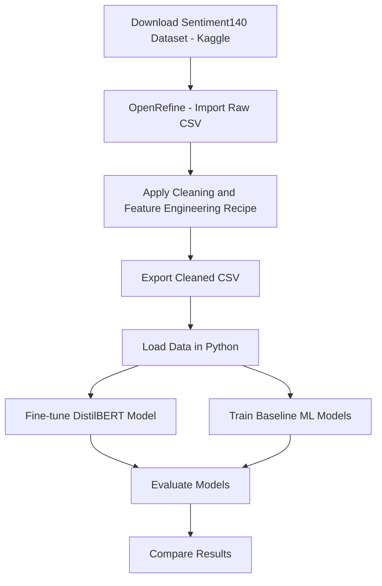

### 12.2 Pipeline Diagram

```mermaid
flowchart TD;
A[Download Sentiment140 Dataset - Kaggle];
B[OpenRefine - Import Raw CSV];
C[Apply Cleaning and Feature Engineering Recipe];
D[Export Cleaned CSV];
E[Load Data in Python];
F[Fine-tune DistilBERT Model];
G[Train Baseline ML Models];
H[Evaluate Models];
I[Compare Results];

A --> B;
B --> C;
C --> D;
D --> E;
E --> F;
E --> G;
F --> H;
G --> H;
H --> I;
```
