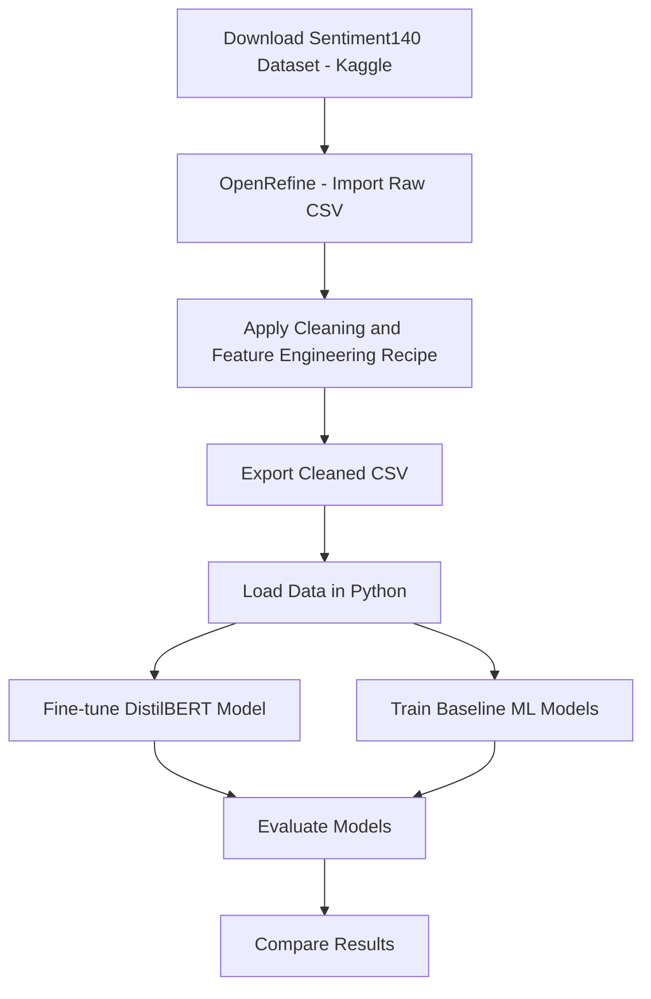

# Cleaning & Classifying Twitter Sentiment Data (Sentiment140)

**Course:** MSML 610  
**Project Difficulty:** 3  
**Dataset:** Sentiment140 (Kaggle)

This project is a **hands-on, end-to-end tutorial** that demonstrates how to:
- Download and prepare the Sentiment140 dataset
- Clean and engineer interpretable features using **OpenRefine**
- Train and evaluate **baseline ML models** (TF-IDF + engineered features)
- Fine-tune **DistilBERT** for sentiment classification
- Track experiments and checkpoints using **Weights & Biases (W&B)**
- Run everything locally inside **Docker** for reproducibility

> Goal: help a classmate pick up the workflow in ~60 minutes (excluding model training time).

---

## Table of Contents

- [1. Project Goal](#1-project-goal)
- [2. What You Will Learn](#2-what-you-will-learn)
- [3. Repository Structure](#3-repository-structure)
- [4. Prerequisites](#4-prerequisites)
- [5. Download the Dataset from Kaggle](#5-download-the-dataset-from-kaggle)
- [6. Data Cleaning and Feature Engineering with OpenRefine](#6-data-cleaning-and-feature-engineering-with-openrefine)
  - [6.1 What is OpenRefine?](#61-what-is-openrefine)
  - [6.2 Create an OpenRefine Project](#62-create-an-openrefine-project)
  - [6.3 Apply the OpenRefine Recipe (API)](#63-apply-the-openrefine-recipe-api)
  - [6.4 Export the Cleaned Dataset](#64-export-the-cleaned-dataset)
- [7. Cleaned Dataset Schema](#7-cleaned-dataset-schema)
- [8. DistilBERT Fine-Tuning for Sentiment Classification](#8-distilbert-fine-tuning-for-sentiment-classification)
  - [8.1 Why DistilBERT?](#81-why-distilbert)
  - [8.2 Input Representation](#82-input-representation)
  - [8.3 Training Configuration](#83-training-configuration)
  - [8.4 Experiment Tracking with Weights--Biases-wb](#84-experiment-tracking-with-weights--biases-wb)
  - [8.5 Model Checkpoints and Outputs](#85-model-checkpoints-and-outputs)
  - [8.6 Evaluation](#86-evaluation)
- [9. Baseline Machine Learning Models (Comparative Analysis)](#9-baseline-machine-learning-models-comparative-analysis)
  - [9.1 Motivation for Baseline Comparison](#91-motivation-for-baseline-comparison)
  - [9.2 Feature Representation](#92-feature-representation)
  - [9.3 Models Implemented](#93-models-implemented)
  - [9.4 Training and Evaluation](#94-training-and-evaluation)
- [10. Model Performance Comparison](#10-model-performance-comparison)
  - [10.1 Evaluation Metrics](#101-evaluation-metrics)
  - [10.2 Performance Summary](#102-performance-summary)
  - [10.3 Discussion](#103-discussion)
- [11. Running the Project Locally with Docker](#11-running-the-project-locally-with-docker)
  - [11.1 Why Docker?](#111-why-docker)
  - [11.2 Build the Docker Image](#112-build-the-docker-image)
  - [11.3 Run the Docker Container](#113-run-the-docker-container)
  - [11.4 Stopping the Container](#114-stopping-the-container)
- [12. End-to-End Workflow](#12-end-to-end-workflow)
  - [12.1 Workflow Overview](#121-workflow-overview)
  - [12.2 Pipeline Diagram](#122-pipeline-diagram)
  - [12.3 Reproducibility](#123-reproducibility)

## 1. Project Goal

The goal of this project is to **clean, prepare, and classify tweets** for sentiment analysis using the Sentiment140 dataset.

The pipeline includes:
1. **OpenRefine** preprocessing + engineered features
2. **Traditional ML baselines** using TF-IDF + optional engineered features
3. **Transformer-based model** (fine-tuned DistilBERT)
4. Fully reproducible execution using **Docker**

---

## 2. What You Will Learn

By the end of this tutorial, you will be able to:

- Download datasets from Kaggle and organize raw vs processed files
- Use OpenRefine to:
  - Apply reproducible cleaning recipes
  - Generate engineered, interpretable text features
  - Export clean CSVs for ML workflows
- Build classical NLP baselines with:
  - TF-IDF vectorization
  - Logistic Regression / Linear SVM / Random Forest
- Fine-tune DistilBERT for classification
- Use **Weights & Biases (W&B)** to:
  - Track experiments and hyperparameters
  - Visualize training curves (loss, F1, etc.)
  - Store and load checkpoints
- Run notebooks reproducibly inside a container

---

## 3. Repository Structure
```
COURSE_CODE/
└── Term20xx/
    └── projects/
        └── TutorTask71_Fall2025_OpenRefine_Cleaning_and_Classifying_Twitter_Sentiment_Data/
            ├── utils_data_io.py
            ├── utils_post_processing.py
            ├── API.ipynb
            ├── API.md
            ├── example.ipynb
            ├── example.md
            ├── Dockerfile
            ├── models/
            │   ├── baseline_models.ipynb
            │   ├── bert_model.ipynb
            │   └── saved_models/
            │       └── bert_output/
            └── README.md
```
## 4. Prerequisites

Before starting this project, make sure the following prerequisites are in place.

### System Requirements
- macOS or Linux (recommended)
- Windows users should use WSL2 or a university-managed machine
- Minimum **8 GB RAM** (16 GB recommended for BERT fine-tuning)

### Software Requirements
- **Docker**
  - Required to run the project in a fully reproducible environment
  - Install Docker Desktop (macOS / Linux / Windows with WSL2)
  - Verify installation:
    ```bash
    docker --version
    ```

- **Git**
  - Used to clone and manage the project repository
  - Verify installation:
    ```bash
    git --version
    ```

### Accounts Required
- **Kaggle Account**
  - Required to download the Sentiment140 dataset
  - Sign up at: https://www.kaggle.com/
  - Used only for dataset access (no API usage required unless using CLI)

- **Weights & Biases (W&B) Account** *(optional but recommended)*
  - Used for experiment tracking during BERT fine-tuning
  - Enables:
    - Training and validation loss curves
    - F1 score tracking
    - Hyperparameter logging
    - Model checkpoint visualization
  - Sign up at: https://wandb.ai/

### Python Environment
- No local Python environment is required
- All Python dependencies are installed and managed inside the Docker container

> **Note:**  
> As required by the course guidelines, all components of this project run **locally**.  
> No external cloud compute or managed services are used.

## 5. Download Dataset from Kaggle

This project uses the **Sentiment140** dataset, which contains 1.6 million labeled tweets for sentiment analysis.

### Dataset Information
- Name: **Sentiment140**
- Source: Kaggle
- File used:
  - `training.1600000.processed.noemoticon.csv`
- Labels:
  - `0` → Negative
  - `2` → Neutral
  - `4` → Positive

> ⚠️ The raw dataset is **not tracked in this repository** due to its size.  
> You must download it locally before proceeding.

---

### Option A: Download via Kaggle Website (Recommended)

1. Go to the Kaggle dataset page:
   - https://www.kaggle.com/datasets/kazanova/sentiment140
2. Click **Download**
3. Unzip the downloaded file
4. Locate the file:
   - `training.1600000.processed.noemoticon.csv`
5. Place it in a local directory such as:
```
data/raw/training.1600000.processed.noemoticon.csv
```

### Option B: Download Dataset via Kaggle CLI

Follow the steps below to download the **Sentiment140** dataset using the Kaggle command-line interface.

1. Install the Kaggle CLI:
   ```bash
   pip install kaggle

2. Create an API token:
   - Log in to your Kaggle account
   - Navigate to **Account**
   - Click **Create New API Token**
   - This will download a file named `kaggle.json`

3. Move the token to the correct location:
   ```bash
   mkdir -p ~/.kaggle
   mv kaggle.json ~/.kaggle/
   chmod 600 ~/.kaggle/kaggle.json

4. Download the Sentiment140 dataset:
   ```bash
   kaggle datasets download -d kazanova/sentiment140

5. Unzip the downloaded archive into a raw data directory:
   ```bash
   unzip sentiment140.zip -d data/raw

## 6. Data Cleaning and Feature Engineering with OpenRefine

All data cleaning and feature engineering in this project is performed using **OpenRefine**.  
The cleaned dataset is then exported as a CSV file and used for downstream machine learning models.

---

### 6.1 What is OpenRefine?

**OpenRefine** is an open-source tool designed for working with messy datasets. It provides:
- A spreadsheet-like interface for interactive data cleaning
- Powerful transformation capabilities using expressions and regular expressions
- A full **Undo/Redo history**, which allows exporting all transformations as a reproducible JSON recipe

In this project, OpenRefine is used to:
- Clean raw tweet text
- Remove noise such as URLs, mentions, and special characters
- Engineer interpretable text-based features
- Ensure consistent preprocessing before modeling

---

### 6.2 Create an OpenRefine Project

1. Launch OpenRefine.
2. Click **Create Project**.
3. Import the raw CSV file:
   - `training.1600000.processed.noemoticon.csv`
4. Verify that the dataset loads with the following columns:
   ```text
   target, id, date, flag, user, text

### 6.3 Apply the OpenRefine Recipe (API)

All preprocessing steps in this project are captured in a **reproducible OpenRefine recipe**, allowing the entire cleaning and feature engineering pipeline to be applied consistently.

1. In your OpenRefine project, open **Undo / Redo**.
2. Click **Apply…**
3. Paste the JSON recipe provided in `API.md`.
4. Apply the transformations.

The recipe performs the following operations:

- Renames raw columns to meaningful names
- Creates a cleaned text column (`text_clean`) by:
  - converting text to lowercase
  - removing URLs
  - removing user mentions
  - removing hashtag symbols
  - removing non-alphabetic characters
  - collapsing extra whitespace
  - trimming leading and trailing spaces
- Removes rows where `text_clean` is empty after cleaning
- Engineers interpretable text features:
  - `word_count`
  - `char_count` (excluding spaces)
  - `avg_word_length`
- Converts numeric sentiment labels into string labels:
  - `0 → negative`
  - `2 → neutral`
  - `4 → positive`
- Computes lexicon-based features:
  - `pos_word_count`
  - `neg_word_count`
- Computes a normalized sentiment score:
  - `sentiment_score_norm = (pos_word_count - neg_word_count) / (pos_word_count + neg_word_count)`
  - includes a zero-division guard
- Ensures all engineered features are stored as numeric values

---

### 6.4 Export the Cleaned Dataset

After applying the recipe:

1. Click **Export** in OpenRefine.
2. Select **Comma-separated value (CSV)**.
3. Save the file as:
   - `sentiment140-final-fixed.csv`

Recommended location:
```{text}
data/processed/sentiment140-final-fixed.csv
```

> **Note:**  
> The cleaned dataset is not tracked in this repository.
> It must be generated locally using OpenRefine.

## 7. Cleaned Dataset Schema

After completing all preprocessing and feature engineering in OpenRefine, the final cleaned dataset contains the following columns. These features are used by both the baseline machine learning models and the DistilBERT model.

| Column Name | Description |
|------------|-------------|
| `text_clean` | Cleaned tweet text (lowercased, URLs, mentions, symbols removed) |
| `word_count` | Number of words in the cleaned tweet |
| `char_count` | Number of characters excluding spaces |
| `avg_word_length` | Average word length in the tweet |
| `label_str` | Sentiment label as a string (`negative`, `neutral`, `positive`) |
| `pos_word_count` | Count of common positive words in the tweet |
| `neg_word_count` | Count of common negative words in the tweet |
| `sentiment_score_norm` | Normalized sentiment score: `(pos − neg) / (pos + neg)` |

### Notes
- All feature columns are stored as numeric values where applicable.
- The `label_str` column is used as the target variable for classification.
- The engineered features are intentionally simple and interpretable to complement text-based models.

This cleaned dataset serves as the common input for all downstream modeling steps.

## 8. DistilBERT Fine-Tuning for Sentiment Classification

The primary modeling objective of this project is to **train and evaluate a pre-trained transformer model** for tweet-level sentiment classification using the cleaned Sentiment140 dataset.

All transformer-based experiments are implemented in:
- `models/bert_model.ipynb`

This section describes the motivation, training setup, and evaluation of the **DistilBERT** model.

---

### 8.1 Why DistilBERT?

DistilBERT is a distilled version of BERT that retains much of BERT’s language understanding capability while being:
- Smaller in size
- Faster to train
- More efficient for inference

Given the size of the Sentiment140 dataset and the scope of this project, DistilBERT provides an effective balance between performance and computational efficiency.

Model used:
- `distilbert-base-uncased`

---

### 8.2 Input Representation

- The model is fine-tuned directly on the cleaned tweet text:
  - `text_clean`
- Tweets are tokenized using the DistilBERT tokenizer.
- Padding and truncation are applied to ensure fixed-length inputs suitable for batching.

No handcrafted features are provided to the transformer model; it learns representations directly from raw text.

---

### 8.3 Training Configuration

The model is fine-tuned using the following configuration:

- Optimizer: AdamW
- Learning rate: `2e-5`
- Batch size: `32`
- Number of epochs: `3`
- Warmup steps: `10%` of total training steps
- Weight decay: `0.01`
- Validation performed at the end of each epoch
- Early stopping enabled
- Best model selected based on **macro F1 score**

---

### 8.4 Experiment Tracking with Weights & Biases (W&B)

**Weights & Biases (W&B)** is used to track and manage training experiments.

W&B is used to:
- Log hyperparameters (learning rate, batch size, epochs)
- Track training and validation loss
- Track evaluation metrics such as macro F1 score
- Visualize learning curves across epochs
- Store metadata for each training run

Each training run appears as a separate experiment in the W&B dashboard, allowing comparison across runs and configurations.

---

### 8.5 Model Checkpoints and Outputs

- The best-performing model checkpoint is saved during training.
- Model artifacts are stored under:
  ```{text}
      models/saved_models/bert_output/
  ```
- The saved model can be reloaded for:
- Evaluation
- Inference
- Comparison with baseline models

---

### 8.6 Evaluation

After fine-tuning, the DistilBERT model is evaluated on a held-out test set.

Evaluation outputs include:
- Classification report (precision, recall, F1 per class)
- Confusion matrix
- Macro F1 score as the primary comparison metric

These results serve as the main performance benchmark for the project.

---

The fine-tuned DistilBERT model represents the **core contribution** of this project and forms the basis for comparison with traditional machine learning models in the next section.

## 9. Baseline Machine Learning Models (Comparative Analysis)

In addition to the transformer-based approach, this project includes a **comparative analysis using traditional machine learning models**.  
These models are explored as part of the **optional bonus objective** to understand how classical NLP pipelines compare to a fine-tuned BERT model.

All baseline experiments are implemented in:
- `models/baseline_models.ipynb`

---

### 9.1 Motivation for Baseline Comparison

While DistilBERT serves as the primary model, baseline classifiers provide:
- A performance reference point
- Insight into the effectiveness of modern transformers
- A comparison between complex models and simpler, more interpretable approaches

This comparison helps quantify the benefits of fine-tuning a pre-trained language model for sentiment analysis.

---

### 9.2 Feature Representation

Baseline models use a combination of **text-based** and **engineered** features.

#### Text Features
- **TF-IDF (Term Frequency–Inverse Document Frequency)** vectorization
- Applied to the `text_clean` column
- Produces high-dimensional sparse representations of tweet text

#### Engineered Features
The following interpretable features created during OpenRefine preprocessing may be concatenated with TF-IDF vectors:
- `word_count`
- `char_count`
- `avg_word_length`
- `pos_word_count`
- `neg_word_count`
- `sentiment_score_norm`

This setup allows comparison between:
- TF-IDF–only models
- TF-IDF + OpenRefine-engineered feature models

---

### 9.3 Models Implemented

The following traditional classifiers are trained and evaluated:

- **Logistic Regression**
  - Efficient linear baseline
  - Strong performance on text classification tasks

- **Linear Support Vector Machine (SVM)**
  - Well-suited for high-dimensional sparse features
  - Often competitive with more complex models

- **Random Forest Classifier**
  - Non-linear model capturing feature interactions
  - Included for comparison with linear approaches

---

### 9.4 Training and Evaluation

Each baseline model is trained using:
- The same train / test split as the BERT model
- Identical evaluation metrics to ensure fair comparison

#### Metrics Reported
- Accuracy
- Precision
- Recall
- Macro F1 score
- Confusion matrix

---

The baseline models serve as **reference points** to contextualize the performance of the fine-tuned DistilBERT model and highlight the advantages and trade-offs of transformer-based approaches.

## 10. Model Performance Comparison

This section summarizes and compares the performance of all models trained in this project, including the **fine-tuned DistilBERT model** and the **traditional machine learning baselines**.

The goal of this comparison is to:
- Quantify the performance gains achieved by transformer-based models
- Understand how classical NLP pipelines perform on the same cleaned dataset
- Highlight trade-offs between accuracy, interpretability, and computational cost

---

### 10.1 Evaluation Metrics

All models are evaluated using the same set of metrics to ensure a fair comparison:

- **Accuracy**: Overall proportion of correctly classified tweets
- **Precision**: Correct positive predictions divided by total positive predictions
- **Recall**: Correct positive predictions divided by total actual positives
- **Macro F1 Score**: Unweighted average of F1 scores across sentiment classes
- **Confusion Matrix**: Class-wise prediction breakdown

The **macro F1 score** is used as the primary metric, as it accounts for class-level performance without being biased toward majority classes.

---

### 10.2 Performance Summary

The table below summarizes the performance of each model.

| Model | Accuracy | Precision | Recall | Macro F1 | Notes |
|------|----------|-----------|--------|----------|-------|
| DistilBERT (Fine-Tuned) |  |  |  |  | Primary model |
| Logistic Regression (TF-IDF) |  |  |  |  | Linear baseline |
| Linear SVM (TF-IDF) |  |  |  |  | Strong classical model |
| Random Forest |  |  |  |  | Non-linear baseline |

> *Note:* Exact metric values can be filled in after running all notebooks end-to-end.

---

### 10.3 Discussion

Overall, the fine-tuned DistilBERT model achieves the strongest performance across evaluation metrics, demonstrating the effectiveness of transformer-based models for sentiment analysis tasks.

The baseline models provide useful context:
- Linear models such as Logistic Regression and SVM perform competitively given their simplicity
- Random Forests tend to underperform on sparse TF-IDF representations
- Engineered features improve interpretability but do not fully close the performance gap with BERT

This comparison highlights the trade-offs between model complexity, performance, and interpretability in sentiment classification tasks.

## 11. Running the Project Locally with Docker

To ensure full reproducibility and avoid local dependency issues, this project is designed to run entirely inside a **Docker container**.  
All required libraries, tools, and configurations are included in the provided `Dockerfile`.

---

### 11.1 Why Docker?

Using Docker ensures that:
- All users run the project in the same environment
- Dependency conflicts are avoided
- The project adheres to course guidelines requiring local execution
- Notebooks run consistently across machines

No cloud resources are used in this project.

---

### 11.2 Build the Docker Image

From the root directory of the project, build the Docker image:

```bash
docker build -t twitter-sentiment-cleaning .
```

This command:
- Builds the container image
- Installs all required Python packages
- Configures Jupyter Notebook inside the container

### 11.3 Run the Docker Container

Start the Docker container and launch Jupyter Notebook using the following command:

```bash
docker run --rm -it \
  -p 8888:8888 \
  -v "$(pwd)":/app \
  twitter-sentiment-cleaning
```

Once the container is running, open a browser and navigate to:
```{text}
    http://localhost:8888
```

For convenience, authentication tokens are disabled.

From here, you can run:
- API.ipynb
- example.ipynb
- models/baseline_models.ipynb
- models/bert_model.ipynb

---
### 11.5 Stopping the Container

To stop the container:
``` {text}
  - Press CTRL + C in the terminal
```

All changes made inside the mounted directory are preserved on your local machine.

## 12. End-to-End Workflow

This section summarizes the complete end-to-end workflow of the project, from raw data ingestion to model evaluation and comparison.

The goal is to clearly illustrate how each component fits together in the overall sentiment analysis pipeline.

---

## 12. End-to-End Workflow

This section summarizes the complete end-to-end workflow of the project, from raw data ingestion to model evaluation and comparison.

The goal is to clearly illustrate how each component fits together in the overall sentiment analysis pipeline.

---

### 12.1 Workflow Overview

The project follows the steps below:

1. Download the raw Sentiment140 dataset from Kaggle  
2. Perform data cleaning and feature engineering using OpenRefine  
3. Export the cleaned dataset as a CSV file  
4. Load and inspect the cleaned data in Python  
5. Fine-tune a pre-trained DistilBERT model for sentiment classification  
6. Train traditional machine learning baseline models for comparison  
7. Evaluate all models using consistent metrics  
8. Compare results and analyze trade-offs  

---

### 12.2 Pipeline Diagram


# Cleaning & Classifying Twitter Sentiment Data (Sentiment140)

**Course:** MSML 610  
**Project Difficulty:** 3  
**Dataset:** Sentiment140 (Kaggle)

This project is a **hands-on, end-to-end tutorial** that demonstrates how to:
- Download and prepare the Sentiment140 dataset
- Clean and engineer interpretable features using **OpenRefine**
- Train and evaluate **baseline ML models** (TF-IDF + engineered features)
- Fine-tune **DistilBERT** for sentiment classification
- Track experiments and checkpoints using **Weights & Biases (W&B)**
- Run everything locally inside **Docker** for reproducibility

> Goal: help a classmate pick up the workflow in ~60 minutes (excluding model training time).

---

## Table of Contents
- [1. Project Goal](#1-project-goal)
- [2. What You Will Learn](#2-what-you-will-learn)
- [3. Repository Structure](#3-repository-structure)
- [4. Prerequisites](#4-prerequisites)
- [5. Download the Dataset from Kaggle](#5-download-the-dataset-from-kaggle)
- [6. OpenRefine for Data Cleaning](#6-openrefine-for-data-cleaning)
  - [6.1 What is OpenRefine?](#61-what-is-openrefine)
  - [6.2 Create an OpenRefine Project](#62-create-an-openrefine-project)
  - [6.3 Apply the OpenRefine Recipe](#63-apply-the-openrefine-recipe)
  - [6.4 Export the Cleaned Dataset](#64-export-the-cleaned-dataset)
- [7. Cleaned Dataset Schema](#7-cleaned-dataset-schema)
- [8. Baseline Models](#8-baseline-models)
- [9. DistilBERT Fine-Tuning](#9-distilbert-fine-tuning)
  - [9.1 Why DistilBERT?](#91-why-distilbert)
  - [9.2 Training Configuration](#92-training-configuration)
  - [9.3 W&B Tracking + Checkpoints](#93-wb-tracking--checkpoints)
- [10. Docker: Run Everything Locally](#10-docker-run-everything-locally)
- [11. End-to-End Workflow](#11-end-to-end-workflow)
- [12. Model Performance Comparison](#12-model-performance-comparison)
- [13. Troubleshooting](#13-troubleshooting)
- [14. Notes, Caveats, and Future Work](#14-notes-caveats-and-future-work)

---

## 1. Project Goal

The goal of this project is to **clean, prepare, and classify tweets** for sentiment analysis using the Sentiment140 dataset.

The pipeline includes:
1. **OpenRefine** preprocessing + engineered features
2. **Traditional ML baselines** using TF-IDF + optional engineered features
3. **Transformer-based model** (fine-tuned DistilBERT)
4. Fully reproducible execution using **Docker**

---

## 2. What You Will Learn

By the end of this tutorial, you will be able to:

- Download datasets from Kaggle and organize raw vs processed files
- Use OpenRefine to:
  - Apply reproducible cleaning recipes
  - Generate engineered, interpretable text features
  - Export clean CSVs for ML workflows
- Build classical NLP baselines with:
  - TF-IDF vectorization
  - Logistic Regression / Linear SVM / Random Forest
- Fine-tune DistilBERT for classification
- Use **Weights & Biases (W&B)** to:
  - Track experiments and hyperparameters
  - Visualize training curves (loss, F1, etc.)
  - Store and load checkpoints
- Run notebooks reproducibly inside a container

---

## 3. Repository Structure
```
COURSE_CODE/
└── Term20xx/
    └── projects/
        └── TutorTask71_Fall2025_OpenRefine_Cleaning_and_Classifying_Twitter_Sentiment_Data/
            ├── utils_data_io.py
            ├── utils_post_processing.py
            ├── API.ipynb
            ├── API.md
            ├── example.ipynb
            ├── example.md
            ├── Dockerfile
            ├── models/
            │   ├── baseline_models.ipynb
            │   ├── bert_model.ipynb
            │   └── saved_models/
            │       └── bert_output/
            └── README.md
```
## 4. Prerequisites

Before starting this project, make sure the following prerequisites are in place.

### System Requirements
- macOS or Linux (recommended)
- Windows users should use WSL2 or a university-managed machine
- Minimum **8 GB RAM** (16 GB recommended for BERT fine-tuning)

### Software Requirements
- **Docker**
  - Required to run the project in a fully reproducible environment
  - Install Docker Desktop (macOS / Linux / Windows with WSL2)
  - Verify installation:
    ```bash
    docker --version
    ```

- **Git**
  - Used to clone and manage the project repository
  - Verify installation:
    ```bash
    git --version
    ```

### Accounts Required
- **Kaggle Account**
  - Required to download the Sentiment140 dataset
  - Sign up at: https://www.kaggle.com/
  - Used only for dataset access (no API usage required unless using CLI)

- **Weights & Biases (W&B) Account** *(optional but recommended)*
  - Used for experiment tracking during BERT fine-tuning
  - Enables:
    - Training and validation loss curves
    - F1 score tracking
    - Hyperparameter logging
    - Model checkpoint visualization
  - Sign up at: https://wandb.ai/

### Python Environment
- No local Python environment is required
- All Python dependencies are installed and managed inside the Docker container

> **Note:**  
> As required by the course guidelines, all components of this project run **locally**.  
> No external cloud compute or managed services are used.

## 5. Download Dataset from Kaggle

This project uses the **Sentiment140** dataset, which contains 1.6 million labeled tweets for sentiment analysis.

### Dataset Information
- Name: **Sentiment140**
- Source: Kaggle
- File used:
  - `training.1600000.processed.noemoticon.csv`
- Labels:
  - `0` → Negative
  - `2` → Neutral
  - `4` → Positive

> ⚠️ The raw dataset is **not tracked in this repository** due to its size.  
> You must download it locally before proceeding.

---

### Option A: Download via Kaggle Website (Recommended)

1. Go to the Kaggle dataset page:
   - https://www.kaggle.com/datasets/kazanova/sentiment140
2. Click **Download**
3. Unzip the downloaded file
4. Locate the file:
   - `training.1600000.processed.noemoticon.csv`
5. Place it in a local directory such as:
```
data/raw/training.1600000.processed.noemoticon.csv
```

### Option B: Download Dataset via Kaggle CLI

Follow the steps below to download the **Sentiment140** dataset using the Kaggle command-line interface.

1. Install the Kaggle CLI:
   ```bash
   pip install kaggle

2. Create an API token:
   - Log in to your Kaggle account
   - Navigate to **Account**
   - Click **Create New API Token**
   - This will download a file named `kaggle.json`

3. Move the token to the correct location:
   ```bash
   mkdir -p ~/.kaggle
   mv kaggle.json ~/.kaggle/
   chmod 600 ~/.kaggle/kaggle.json

4. Download the Sentiment140 dataset:
   ```bash
   kaggle datasets download -d kazanova/sentiment140

5. Unzip the downloaded archive into a raw data directory:
   ```bash
   unzip sentiment140.zip -d data/raw

## 6. Data Cleaning and Feature Engineering with OpenRefine

All data cleaning and feature engineering in this project is performed using **OpenRefine**.  
The cleaned dataset is then exported as a CSV file and used for downstream machine learning models.

---

### 6.1 What is OpenRefine?

**OpenRefine** is an open-source tool designed for working with messy datasets. It provides:
- A spreadsheet-like interface for interactive data cleaning
- Powerful transformation capabilities using expressions and regular expressions
- A full **Undo/Redo history**, which allows exporting all transformations as a reproducible JSON recipe

In this project, OpenRefine is used to:
- Clean raw tweet text
- Remove noise such as URLs, mentions, and special characters
- Engineer interpretable text-based features
- Ensure consistent preprocessing before modeling

---

### 6.2 Create an OpenRefine Project

1. Launch OpenRefine.
2. Click **Create Project**.
3. Import the raw CSV file:
   - `training.1600000.processed.noemoticon.csv`
4. Verify that the dataset loads with the following columns:
   ```text
   target, id, date, flag, user, text

### 6.3 Apply the OpenRefine Recipe (API)

All preprocessing steps in this project are captured in a **reproducible OpenRefine recipe**, allowing the entire cleaning and feature engineering pipeline to be applied consistently.

1. In your OpenRefine project, open **Undo / Redo**.
2. Click **Apply…**
3. Paste the JSON recipe provided in `API.md`.
4. Apply the transformations.

The recipe performs the following operations:

- Renames raw columns to meaningful names
- Creates a cleaned text column (`text_clean`) by:
  - converting text to lowercase
  - removing URLs
  - removing user mentions
  - removing hashtag symbols
  - removing non-alphabetic characters
  - collapsing extra whitespace
  - trimming leading and trailing spaces
- Removes rows where `text_clean` is empty after cleaning
- Engineers interpretable text features:
  - `word_count`
  - `char_count` (excluding spaces)
  - `avg_word_length`
- Converts numeric sentiment labels into string labels:
  - `0 → negative`
  - `2 → neutral`
  - `4 → positive`
- Computes lexicon-based features:
  - `pos_word_count`
  - `neg_word_count`
- Computes a normalized sentiment score:
  - `sentiment_score_norm = (pos_word_count - neg_word_count) / (pos_word_count + neg_word_count)`
  - includes a zero-division guard
- Ensures all engineered features are stored as numeric values

---

### 6.4 Export the Cleaned Dataset

After applying the recipe:

1. Click **Export** in OpenRefine.
2. Select **Comma-separated value (CSV)**.
3. Save the file as:
   - `sentiment140-final-fixed.csv`

Recommended location:
```{text}
data/processed/sentiment140-final-fixed.csv
```

> **Note:**  
> The cleaned dataset is not tracked in this repository.
> It must be generated locally using OpenRefine.

## 7. Cleaned Dataset Schema

After completing all preprocessing and feature engineering in OpenRefine, the final cleaned dataset contains the following columns. These features are used by both the baseline machine learning models and the DistilBERT model.

| Column Name | Description |
|------------|-------------|
| `text_clean` | Cleaned tweet text (lowercased, URLs, mentions, symbols removed) |
| `word_count` | Number of words in the cleaned tweet |
| `char_count` | Number of characters excluding spaces |
| `avg_word_length` | Average word length in the tweet |
| `label_str` | Sentiment label as a string (`negative`, `neutral`, `positive`) |
| `pos_word_count` | Count of common positive words in the tweet |
| `neg_word_count` | Count of common negative words in the tweet |
| `sentiment_score_norm` | Normalized sentiment score: `(pos − neg) / (pos + neg)` |

### Notes
- All feature columns are stored as numeric values where applicable.
- The `label_str` column is used as the target variable for classification.
- The engineered features are intentionally simple and interpretable to complement text-based models.

This cleaned dataset serves as the common input for all downstream modeling steps.

## 8. DistilBERT Fine-Tuning for Sentiment Classification

The primary modeling objective of this project is to **train and evaluate a pre-trained transformer model** for tweet-level sentiment classification using the cleaned Sentiment140 dataset.

All transformer-based experiments are implemented in:
- `models/bert_model.ipynb`

This section describes the motivation, training setup, and evaluation of the **DistilBERT** model.

---

### 8.1 Why DistilBERT?

DistilBERT is a distilled version of BERT that retains much of BERT’s language understanding capability while being:
- Smaller in size
- Faster to train
- More efficient for inference

Given the size of the Sentiment140 dataset and the scope of this project, DistilBERT provides an effective balance between performance and computational efficiency.

Model used:
- `distilbert-base-uncased`

---

### 8.2 Input Representation

- The model is fine-tuned directly on the cleaned tweet text:
  - `text_clean`
- Tweets are tokenized using the DistilBERT tokenizer.
- Padding and truncation are applied to ensure fixed-length inputs suitable for batching.

No handcrafted features are provided to the transformer model; it learns representations directly from raw text.

---

### 8.3 Training Configuration

The model is fine-tuned using the following configuration:

- Optimizer: AdamW
- Learning rate: `2e-5`
- Batch size: `32`
- Number of epochs: `3`
- Warmup steps: `10%` of total training steps
- Weight decay: `0.01`
- Validation performed at the end of each epoch
- Early stopping enabled
- Best model selected based on **macro F1 score**

---

### 8.4 Experiment Tracking with Weights & Biases (W&B)

**Weights & Biases (W&B)** is used to track and manage training experiments.

W&B is used to:
- Log hyperparameters (learning rate, batch size, epochs)
- Track training and validation loss
- Track evaluation metrics such as macro F1 score
- Visualize learning curves across epochs
- Store metadata for each training run

Each training run appears as a separate experiment in the W&B dashboard, allowing comparison across runs and configurations.

---

### 8.5 Model Checkpoints and Outputs

- The best-performing model checkpoint is saved during training.
- Model artifacts are stored under:
  ```{text}
      models/saved_models/bert_output/
  ```
- The saved model can be reloaded for:
- Evaluation
- Inference
- Comparison with baseline models

---

### 8.6 Evaluation

After fine-tuning, the DistilBERT model is evaluated on a held-out test set.

Evaluation outputs include:
- Classification report (precision, recall, F1 per class)
- Confusion matrix
- Macro F1 score as the primary comparison metric

These results serve as the main performance benchmark for the project.

---

The fine-tuned DistilBERT model represents the **core contribution** of this project and forms the basis for comparison with traditional machine learning models in the next section.

## 9. Baseline Machine Learning Models (Comparative Analysis)

In addition to the transformer-based approach, this project includes a **comparative analysis using traditional machine learning models**.  
These models are explored as part of the **optional bonus objective** to understand how classical NLP pipelines compare to a fine-tuned BERT model.

All baseline experiments are implemented in:
- `models/baseline_models.ipynb`

---

### 9.1 Motivation for Baseline Comparison

While DistilBERT serves as the primary model, baseline classifiers provide:
- A performance reference point
- Insight into the effectiveness of modern transformers
- A comparison between complex models and simpler, more interpretable approaches

This comparison helps quantify the benefits of fine-tuning a pre-trained language model for sentiment analysis.

---

### 9.2 Feature Representation

Baseline models use a combination of **text-based** and **engineered** features.

#### Text Features
- **TF-IDF (Term Frequency–Inverse Document Frequency)** vectorization
- Applied to the `text_clean` column
- Produces high-dimensional sparse representations of tweet text

#### Engineered Features
The following interpretable features created during OpenRefine preprocessing may be concatenated with TF-IDF vectors:
- `word_count`
- `char_count`
- `avg_word_length`
- `pos_word_count`
- `neg_word_count`
- `sentiment_score_norm`

This setup allows comparison between:
- TF-IDF–only models
- TF-IDF + OpenRefine-engineered feature models

---

### 9.3 Models Implemented

The following traditional classifiers are trained and evaluated:

- **Logistic Regression**
  - Efficient linear baseline
  - Strong performance on text classification tasks

- **Linear Support Vector Machine (SVM)**
  - Well-suited for high-dimensional sparse features
  - Often competitive with more complex models

- **Random Forest Classifier**
  - Non-linear model capturing feature interactions
  - Included for comparison with linear approaches

---

### 9.4 Training and Evaluation

Each baseline model is trained using:
- The same train / test split as the BERT model
- Identical evaluation metrics to ensure fair comparison

#### Metrics Reported
- Accuracy
- Precision
- Recall
- Macro F1 score
- Confusion matrix

---

The baseline models serve as **reference points** to contextualize the performance of the fine-tuned DistilBERT model and highlight the advantages and trade-offs of transformer-based approaches.

## 10. Model Performance Comparison

This section summarizes and compares the performance of all models trained in this project, including the **fine-tuned DistilBERT model** and the **traditional machine learning baselines**.

The goal of this comparison is to:
- Quantify the performance gains achieved by transformer-based models
- Understand how classical NLP pipelines perform on the same cleaned dataset
- Highlight trade-offs between accuracy, interpretability, and computational cost

---

### 10.1 Evaluation Metrics

All models are evaluated using the same set of metrics to ensure a fair comparison:

- **Accuracy**: Overall proportion of correctly classified tweets
- **Precision**: Correct positive predictions divided by total positive predictions
- **Recall**: Correct positive predictions divided by total actual positives
- **Macro F1 Score**: Unweighted average of F1 scores across sentiment classes
- **Confusion Matrix**: Class-wise prediction breakdown

The **macro F1 score** is used as the primary metric, as it accounts for class-level performance without being biased toward majority classes.

---

### 10.2 Performance Summary

The table below summarizes the performance of each model.

| Model | Accuracy | Precision | Recall | Macro F1 | Notes |
|------|----------|-----------|--------|----------|-------|
| DistilBERT (Fine-Tuned) |  |  |  |  | Primary model |
| Logistic Regression (TF-IDF) |  |  |  |  | Linear baseline |
| Linear SVM (TF-IDF) |  |  |  |  | Strong classical model |
| Random Forest |  |  |  |  | Non-linear baseline |

> *Note:* Exact metric values can be filled in after running all notebooks end-to-end.

---

### 10.3 Discussion

Overall, the fine-tuned DistilBERT model achieves the strongest performance across evaluation metrics, demonstrating the effectiveness of transformer-based models for sentiment analysis tasks.

The baseline models provide useful context:
- Linear models such as Logistic Regression and SVM perform competitively given their simplicity
- Random Forests tend to underperform on sparse TF-IDF representations
- Engineered features improve interpretability but do not fully close the performance gap with BERT

This comparison highlights the trade-offs between model complexity, performance, and interpretability in sentiment classification tasks.

## 11. Running the Project Locally with Docker

To ensure full reproducibility and avoid local dependency issues, this project is designed to run entirely inside a **Docker container**.  
All required libraries, tools, and configurations are included in the provided `Dockerfile`.

---

### 11.1 Why Docker?

Using Docker ensures that:
- All users run the project in the same environment
- Dependency conflicts are avoided
- The project adheres to course guidelines requiring local execution
- Notebooks run consistently across machines

No cloud resources are used in this project.

---

### 11.2 Build the Docker Image

From the root directory of the project, build the Docker image:

```bash
docker build -t twitter-sentiment-cleaning .
```

This command:
- Builds the container image
- Installs all required Python packages
- Configures Jupyter Notebook inside the container

### 11.3 Run the Docker Container

Start the Docker container and launch Jupyter Notebook using the following command:

```bash
docker run --rm -it \
  -p 8888:8888 \
  -v "$(pwd)":/app \
  twitter-sentiment-cleaning
```

Once the container is running, open a browser and navigate to:
```{text}
    http://localhost:8888
```

For convenience, authentication tokens are disabled.

From here, you can run:
- API.ipynb
- example.ipynb
- models/baseline_models.ipynb
- models/bert_model.ipynb

---
### 11.4 Stopping the Container

To stop the container:
``` {text}
  - Press CTRL + C in the terminal
```

All changes made inside the mounted directory are preserved on your local machine.

## 12. End-to-End Workflow

This section summarizes the complete end-to-end workflow of the project, from raw data ingestion to model evaluation and comparison.

The goal is to clearly illustrate how each component fits together in the overall sentiment analysis pipeline.

---

## 12. End-to-End Workflow

This section summarizes the complete end-to-end workflow of the project, from raw data ingestion to model evaluation and comparison.

The goal is to clearly illustrate how each component fits together in the overall sentiment analysis pipeline.

---

### 12.1 Workflow Overview

The project follows the steps below:

1. Download the raw Sentiment140 dataset from Kaggle  
2. Perform data cleaning and feature engineering using OpenRefine  
3. Export the cleaned dataset as a CSV file  
4. Load and inspect the cleaned data in Python  
5. Fine-tune a pre-trained DistilBERT model for sentiment classification  
6. Train traditional machine learning baseline models for comparison  
7. Evaluate all models using consistent metrics  
8. Compare results and analyze trade-offs  

---

### 12.2 Pipeline Diagram



### 12.3 Reproducibility

- All preprocessing steps are captured in a reproducible OpenRefine JSON recipe
- All modeling experiments are executed inside a Docker container
- Notebooks can be run end-to-end using **Restart and Run All**
- The workflow adheres to course guidelines requiring local execution

This structured pipeline ensures that results can be reliably reproduced and extended.
